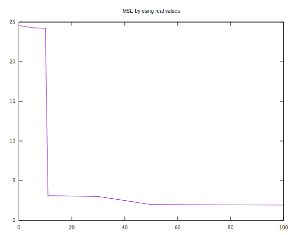

# Best to Analyse
In order to find out what brings the biggest effect
to be analyzed the submission using the mean value
of all shop/items was taken as a base.
The the shop/items with the most sales where replaced
by their real value in order to find out how
big would be the effect if could be guessed correctly.

This was done by writing a local tester that tests 
against the (known) value of month 33.

The first result shows that most of the effect could be 
reached by optimizing a single shop/item. **12/11373**

```
shop   item    n        mse
--------------------------- 
          -    0      24.62  
 31   20949    1      24.51
 42   20949    5      24.28
 22   20949   10      24.21
 12   11373   11       3.10
 21   20949   12       3.09
 30   20949   13       3.09
 46   20949   14       3.09

shop / item ... The latest added shop/item
n           ... Number of real values
mse         ... Mean squared error of the submission
```




Actually that could only mean that the reason for that
could only be a data error.

Therefor that data was removed for further analyses.
