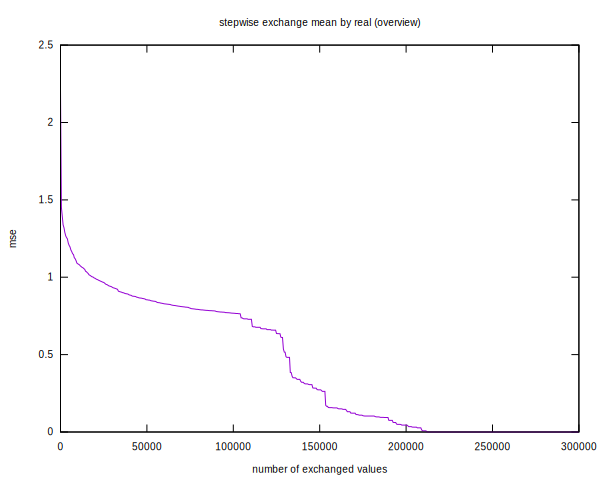

# Stepwise replacement of real values
Taking just the mean value of all sales by
shop/item (mse: 2.5) as a base and replacing stepwise
the proposed results by the real value leads to the 
following curve.

Wher that curve has a steep slope it makes 
sense to use better means than the mean value.

These regions could be the shop/items ordered
by their mean sales of ondex 0 to 300 and those
of index 100.000 to 160.000. 

It should make sense to analyse these two groups in
detail and eventually find different procedures for that 
groups.

